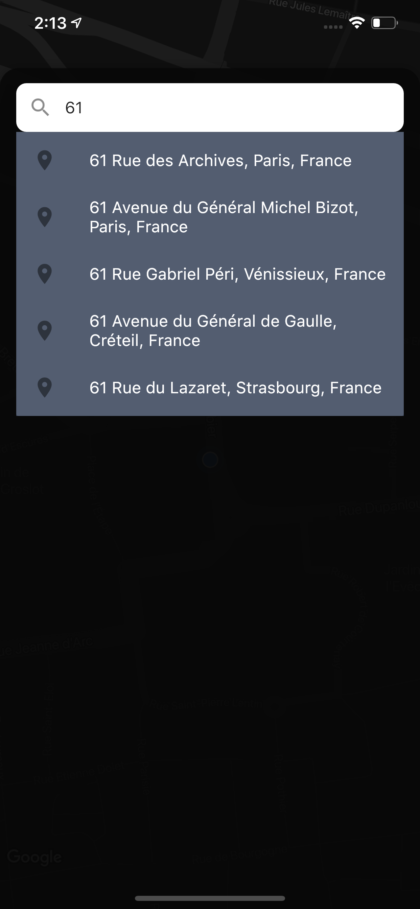
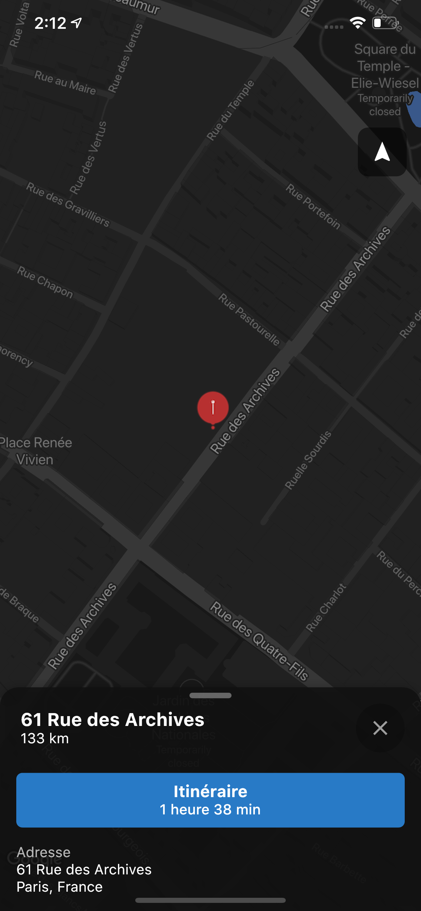
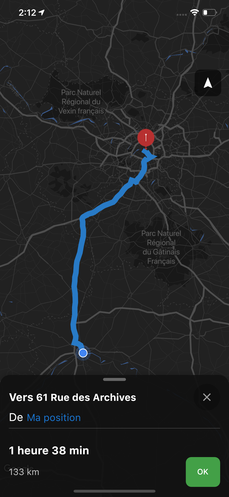
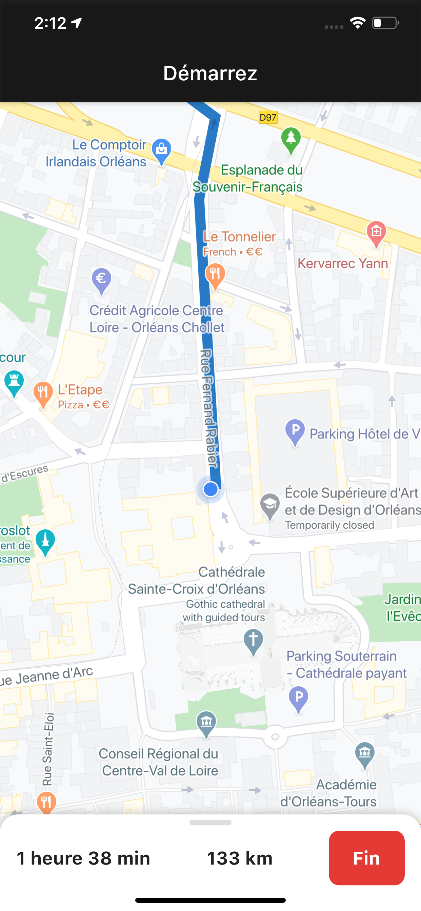

### About the project

The purpose of this project is to develop a part of the Apple Plans to practice with Google maps and location.

This project has been built using the [Flutter](https://flutter.io/) framework, which allows to build an app for mobile, desktop & web, from a single codebase.

<p align="center">
  
  
  
  
</p>

## Features

- **Tracking**: Get user location
- **Autocomplete**: Generate a list of locations based on user input
- **Details Travel**: Get duration and distance  details for a travel

## Download & install

First, clone the repository with the 'clone' command, or just download the zip.

```
$ git clone https://github.com/felixferr/clone_plans_ios.git
```
Then, download either Android Studio or Visual Studio Code, with their respective [Flutter editor plugins](https://flutter.io/get-started/editor/). For more information about Flutter installation procedure, check the [official install guide](https://flutter.io/get-started/install/).

Install dependencies from pubspec.yaml by running `flutter packages get` from the project root (see [using packages documentation](https://flutter.io/using-packages/#adding-a-package-dependency-to-an-app) for details and how to do this in the editor).

**Creating API KEYS**

In order to get started with Google Maps you first need to create an API key for your new project. To create an API key navigate to the [Google Maps](https://cloud.google.com/maps-platform/maps/?&sign=0) and click GET STARTED to step through the wizard to set up your API key.
On the following screens you need to:

- Enable Google Maps API(select Maps and Places).
- Create a new project called Flutter Maps.
- Choose a billing account (don’t worry there is a free tier to use).

1. Create a file => credentials.dart and put the key in : const kGoogleApiKey = 'YOUR API KEY';
2. Activate the [Directions API](https://console.cloud.google.com/marketplace/details/google/directions-backend.googleapis.com) and put the key to the credentials file : const kGoogleApiKeyDirections = 'YOUR API KEY';

There you go, you can now run the project. Enjoy!